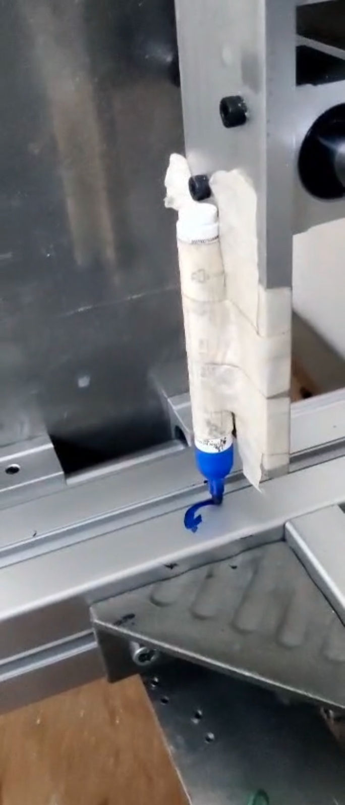

# DIY CNC VMC using linuxcnc
## Project description :
In this project I built a three axis cnc vmc using linuxcnc with parellel port to understand how cnc works from ground up.An old pc is used as controller . parallel breakoutout board interfaces motor driver with linuxcnc pc . Aluminium extrusion  and aluminium 6061 is used to build the frame and gantry.Homing and posistion accuracy were tested out succesfully demo video is shown below.Since spindle was not included at this stage marker based toolpath was performed to validate the machine movements.

## Table of contents :
- [Material used](#Material_used)
- [Software](#Software)
- [MECHANICAL DESIGN](#MECHANICAL_DESIGN)
- [Electrical system](#Electrical_system)
- [DEMO](#DEMO)
https://github.com/user-attachments/assets/18433773-768f-4c93-b49d-c50b6d1e068b

#### Material_used : 

- MACH3 parallel port break out boaed

- Nema 23 open loop stepper motors

- dm542t stepper drivers

- old Desktop computer 
- parallel pci card 
- aluminium 6061 for gantry build 
- aaluminium extrusion size:6060 
- ballscrew 1605 and supports 
- contactors , mcbb and isolators 
- limit switches ,emergency stop and shielded wires

## Software

### Install LinuxCNC
- Download LinuxCNC ISO
- Flash to USB
- Install on PC
- Verify real-time latency (Mine had high latency so during execution steps might get missed so make sure you choose right pc or use an motion controller)

##### STEPCONF WIZARD CONFIGURATION: FOR INITIAL SETUP

- Select paraller port 
- choose pins for step/dir ,limit switches , estop and spindle 
- Calculate your steps per mm and enter it 
- enter velocity and accelearation
- enter microstepping value 

## MECHANICAL_DESIGN:

- The mechanical structure was inspired by existing CNC CAD models available online
- Aluminium extrusion and 6061 plates(10MM-THICKNESS) were used for rigidity
- Ball screws were used on all three axes for  accuracy
- Some CAD reference models are attached for design understanding

## Electrical_system :

- 230V AC,6A single-phase supply used as the main input power source
- 36V,12A SMPS used to power the stepper motor drivers (DM542T)
- Shielded motor cables used between drivers and stepper motors to reduce EMI and electrical noise
- 5V SMPS used to power the parallel port breakout board and control electronics
- MCBs used for overcurrent and short-circuit protection
- Contactors used for main power switching and emergency isolation
- Isolators used to safely disconnect power during maintenance
## DEMO
  - CIRCULAR INTERPOLATION:
    
